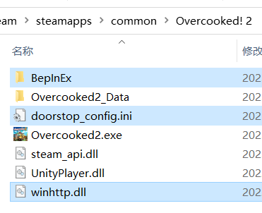

# 胡闹厨房2 - 投掷模组

## 安装

1. 安装 BepInEx 5 (x86)（[GitHub](https://github.com/BepInEx/BepInEx/releases) 或 [百度网盘链接](https://pan.baidu.com/s/1G81rpJNwVsJplJi6fD2jPA?pwd=lobe)），解压后拷贝到游戏根目录下

   

       
   

   > 开启 `BepInEx` 的控制台可能会导致无法以手柄进入游戏。确保配置文件 `BepInEx/config/BepInEx.cfg` 中 `[Logging.Console]` 组中值为 `Enabled = false`。

2. 将 `OC2ThrowAny.dll` 拷贝到 `BepInEx\plugins` 文件夹中即可

## 使用

- 在游戏主菜单设定 - MOD 中设置是否启用（默认不启用）。
  - 投掷达人：可以投掷除灭火器、水枪、奶油、呼呼外的任何物品。
  - 投掷人：可以抬起和投掷其他厨师（客机受延迟影响较大）。
- 在 `街机公开` 中模组无效。
- 主客机都启用，客机才能投掷。

